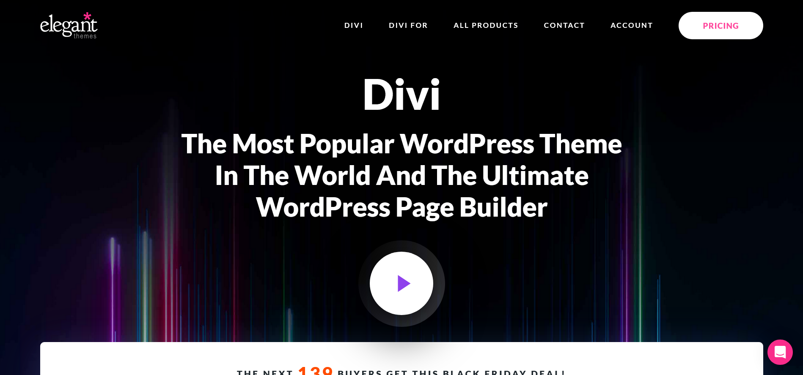
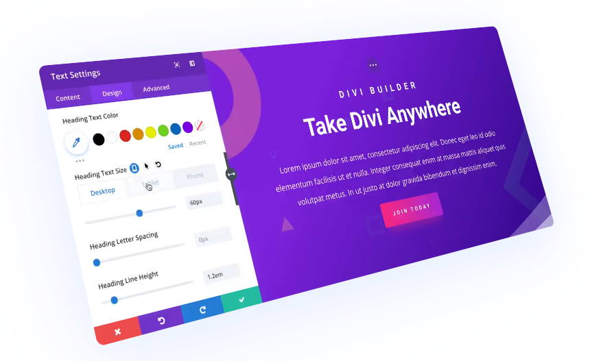

# Projet de groupe

Produit choisie : **Divi**

## Définissez votre positionnement et vos avantages concurrentiels

- ### Description :

    **Divi** est un système de gestion de compostant pour créer des sites web dynamique ou statique.

- ### Arguments :

    **Divi**, contrairement à ses concurrents, propose à ses clients une formule "One Time" qui correspond à un payement en une seule fois et un produit disponible à vie avec les mises à jour. Mais il propose également un système d'abonnement.

    Les concurrents de **Divi**, ont tous un prix supérieur à la solution proposé par **Divi**.

    **Divi** propose une interface simple et facile à prendre en main même pour un néophyte.

    Une grosse communauté (Facebook, etc.) est disponible sur internet pour pouvoir guider au mieux l'utilisateur.

